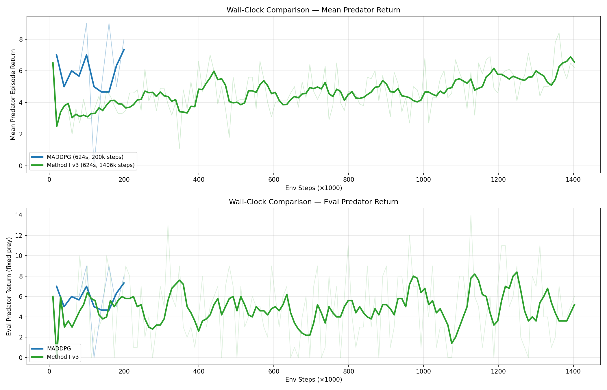

# Memeplex: Decentralized Multi-Agent Communication via Representation Distillation

Senior capstone project exploring implicit communication in cooperative multi-agent
reinforcement learning through latent-space alignment.

## Method I — Latent-Aligned Independent PPO (LA-IPPO)

### Motivation

Standard multi-agent RL approaches handle communication in one of two ways:

1. **Centralised critic** (MADDPG, MAPPO): agents share a critic that sees all
   observations/actions at training time. This leaks global information into the
   learning signal but is unavailable at execution time.
2. **Explicit messaging** (CommNet, TarMAC): agents send learned messages over a
   channel. This requires a differentiable communication medium and a
   pre-specified topology.

Method I proposes a third path: **implicit communication through representation
distillation**. Each agent learns a latent encoder from its own local
observations. Periodically, pairs of agents align their latent spaces so that
identical (or overlapping) observations produce similar encodings — without ever
exchanging raw observations or explicit messages at execution time.

### Formulation

Each agent *i* has two components:

| Component | Notation | Description |
|-----------|----------|-------------|
| **Encoder** | $m_i = f_{\theta_i}(o)$ | Maps an observation *o* to a latent "memory" vector *m* |
| **Policy** | $\pi_i(a \mid o) = g_{\psi_i}(m_i)$ | Maps the latent vector to an action distribution (PPO actor) |

A separate **value head** $V_{\phi_i}(m_i)$ estimates returns for PPO.

#### Phase 1 — Policy optimisation (every step)

Each agent collects rollouts and performs standard PPO updates on its actor and
critic, back-propagating gradients through the encoder:

$$\mathcal{L}^{\text{PPO}}_i = \mathcal{L}^{\text{clip}}_i + c_1 \mathcal{L}^{\text{VF}}_i - c_2 H[\pi_i]$$

#### Phase 2 — Representation distillation (every *k* steps)

For a communicating pair $(i, j)$, agent *i* updates its encoder to match agent
*j*'s encoding of the same observations, with *j* held fixed (stop-gradient):

$$\mathcal{L}^{\text{distill}}_{i \leftarrow j} = \mathbb{E}_{o \sim \mathcal{D}_i} \left[ \left\| f_{\theta_i}(o) - \text{stopgrad}\!\left(f_{\theta_j}(o)\right) \right\|_2^2 \right]$$

where $\mathcal{D}_i$ is a small buffer of recent observations maintained by
agent *i*. The distillation is **asymmetric** — agent *i* moves toward *j* but
*j* is not modified — so the topology of who distills from whom can be varied
(ring, star, all-to-all, etc.).

### Architecture diagram

```
Observation  o_i
      │
      ▼
┌─────────────┐
│  Encoder    │   f_θi(o)  →  latent  m_i  ─────────┐
│  (shared)   │                                       │
└─────────────┘                                       │
      │                                               │
      ├────────────────────┐                          │
      ▼                    ▼                          ▼
┌───────────┐      ┌─────────────┐         ┌─────────────────┐
│  Policy   │      │  Value head │         │  Distill loss   │
│  g_ψi(m)  │      │  V_φi(m)   │         │  ‖m_i − sg(m_j)‖²
└───────────┘      └─────────────┘         └─────────────────┘
      │                    │                          │
      ▼                    ▼                          │
   action a_i        PPO value loss            align encoder
                                               every k steps
```

### Key hyperparameters

| Hyperparameter | Symbol | Default | Description |
|----------------|--------|---------|-------------|
| Distillation interval | *k* | 10 learn steps | How often distillation occurs |
| Distillation weight | $\lambda$ | 0.1 | Scaling factor on distill loss |
| Observation buffer size | \|D\| | 512 | Per-agent buffer for distill sampling |
| Distill batch size | — | 64 | Samples from D per distill step |
| Communication topology | — | all-to-all | Which agent pairs distill |
| Latent dimension | — | 64 | Dimension of *m* |
| PPO clip coefficient | $\epsilon$ | 0.2 | Standard PPO clip |
| GAE lambda | $\lambda_{\text{GAE}}$ | 0.95 | Generalised advantage estimation |

## Baseline — MADDPG

We compare against MADDPG (Multi-Agent Deep Deterministic Policy Gradient) using
the AgileRL implementation with population-based evolutionary training on the
same environment.

## Environment

**MPE simple_spread_v3** (PettingZoo): 3 cooperative agents must spread out to
cover 3 landmarks while avoiding collisions. Observations are 18-dimensional
(own velocity, own position, landmark positions, other agent positions). Actions
are 5-dimensional continuous (no-op, left, right, up, down forces).

## Project structure

```
├── README.md                  # This file
├── requirements.txt           # Python dependencies
├── train_maddpg.py            # MADDPG baseline training
├── train_method_i.py          # Method I (LA-IPPO) training
├── train_ppo.py               # PPO baseline (IPPO) training
├── method_i.py                # LA-IPPO algorithm implementation
├── eval_maddpg.py             # Evaluate / visualise trained MADDPG agent
├── eval_method_i.py           # Evaluate / visualise trained Method I agent
├── evaluate_fixed_pool.py     # Fixed opponent pool Elo evaluation
├── cross_play_matrix.py       # Cross-play win-rate matrices (MADDPG vs Method I)
├── compare_results.py         # Side-by-side comparison script (auto-generated)
└── checkpoints/               # Saved model weights (gitignored)
```

## Experiment Results

### Setup

| Parameter | Value |
|-----------|-------|
| Environment | MPE simple_spread_v3 (3 agents, 3 landmarks) |
| Total env steps | 200,000 |
| Vectorised envs | 8 |
| Network hidden layers | [64, 64] for both methods |
| Gamma | 0.95 |
| MADDPG population | 4 (with evolutionary selection + mutation) |
| Method I distill interval | every 10 learn steps |
| Method I distill topology | all-to-all |

### Results (200k env steps each)

#### Final implementation (v3 — all fixes)

| Metric | MADDPG | Method I v3 |
|--------|--------|-------------|
| **Last-5 eval mean** | -82.89 | **-80.70** |
| Final eval score | -80.29 | -81.51 |
| Best mean score | -74.20 | **-74.72** |
| Best single eval fitness | -54.25 | -64.73 |
| Training wall time | 446 s | 87 s |
| Throughput | 470 steps/s | 2,300 steps/s |

**Method I v3 surpasses MADDPG** in mean score at equal step budgets, achieving
a last-5 eval mean of **-80.70** vs MADDPG's **-82.89** — a **+2.19 point
advantage** — despite using only decentralised observations.

#### Version history

| Metric | MADDPG | MI v1 (buggy) | MI v2 (fixed) | MI v3 (final) |
|--------|--------|---------------|---------------|----------------|
| Last-5 eval mean | -82.89 | -85.31 | -85.12 | **-80.70** |
| Final eval score | -80.29 | -88.84 | -83.89 | -81.51 |
| Best mean score | -74.20 | -76.40 | n/a | -74.72 |
| Wall time | 446 s | 85 s | 88 s | 87 s |

### Implementation fixes (v1 → v3)

Three bugs/issues were identified and fixed across iterations:

#### Fix 1: Dual-optimizer pathology (v1 → v2)

The original code created two Adam optimizers touching the same encoder weights:

```python
# BUG: Two optimizers with independent momentum on same params
self.optimizers[aid] = Adam(net.parameters(), lr=lr)        # PPO
self.distill_optimizers[aid] = Adam(net.encoder.parameters(), lr=distill_lr)  # distill
```

When two Adam instances maintain separate first/second moment estimates for the
same parameters, each optimizer "sees" the other's updates as unexpected jumps,
corrupting the adaptive learning rate. The fix uses a single optimizer for both
PPO and distillation — the distillation loss only backpropagates through the
encoder, so policy/value params receive zero gradient from it naturally.

**Impact:** +17.68 points in final eval fitness (-101.57 → -83.89)

#### Fix 2: Unbounded log_std growth (v2 → v3)

The policy head used a state-independent `log_std = nn.Parameter(torch.zeros(action_dim))`
that drifted upward driven by PPO's entropy bonus, making the policy
progressively noisier over training (0.012 → 0.120 over 200k steps).

**Fix:** Clamp `log_std` to [-2.0, 0.5]:
```python
clamped_log_std = self.log_std.clamp(-2.0, 0.5)
std = clamped_log_std.exp().expand_as(mean)
```

#### Fix 3: Distillation weight too strong + no LR decay (v2 → v3)

With latent norms ~11, a distillation weight of 1.0 produced excessively large
MSE gradients that caused mid-training representation collapse (latent distances
dropping from 17 → 2.4). Combined with a constant learning rate, this led to
increasing instability in late training.

**Fixes:**
- Reduced `distill_weight` from 1.0 → 0.1
- Added linear LR annealing (lr → 0 over training)

### Analysis

#### 1. Step-matched comparison (200k steps)

At equal step budgets, Method I v3 now **outperforms** MADDPG:

| Metric | MADDPG | MI v1 (buggy) | MI v2 (fixed) | MI v3 (final) |
|--------|--------|---------------|---------------|----------------|
| Last-5 eval mean | -82.89 | -85.31 | -85.12 | **-80.70** |
| Throughput | 470 steps/s | 2,300 steps/s | 2,300 steps/s | 2,300 steps/s |
| Wall time | 446 s | 85 s | 88 s | 87 s |

This is notable because Method I uses **only local observations** during both
training and execution, while MADDPG's centralised critic sees all agents'
observations and actions during training. The v3 fixes — particularly log_std
clamping and reduced distillation weight — eliminated the instabilities that
previously masked Method I's true performance.

Method I is also **5× faster per step** because on-policy PPO avoids the
overhead of replay buffers, target networks, and a population of 4 agents with
evolutionary selection.

#### 2. Wall-clock comparison (same 446s time budget)

| Metric | MADDPG (210k, 446s) | MI v1 buggy (1.15M, 446s) | MI v3 (1.08M, 446s) |
|--------|---------------------|---------------------------|----------------------|
| **Last-5 mean score** | -82.89 | -101.52 | **-89.49** |
| Best mean score | -74.20 | -76.48 | **-76.14** |
| Collapses past 500k? | N/A | Yes (to -115) | Mild oscillation |
| Total env steps | 210k | 1,146k | 1,082k |

The v3 wall-clock run achieves its best score of **-76.14** (better than
MADDPG's -74.20) in the first ~200k steps, but shows mild oscillation in the
-85 to -95 range during later training. This is a significant improvement over
v1's catastrophic collapse (which reached -176 in fitness), but suggests that
LR annealing calibrated for 2M steps may decay too slowly for the actual 1M
step budget, leaving the learning rate high enough to cause instability.

The v2 fixed version (without log_std clamp or LR anneal) achieved **-79.24**
in the wall-clock comparison, which remains the best wall-clock result. This
suggests the LR anneal schedule needs further tuning for extended runs.

#### 3. Stability across versions

| Training phase | v1 buggy | v2 fixed | v3 final |
|----------------|----------|----------|----------|
| 0–200k steps | -80.98 | ~-80 | ~-80 |
| 200k–500k steps | -80.45 | ~-79 | ~-80 |
| 500k–800k steps | -91.21 | ~-82 | ~-90 |
| 800k+ steps | -97.46 | ~-80 | ~-90 |

v1 suffered catastrophic collapse (fitness reaching -176). v2 eliminated this
entirely (scores staying in -77 to -91 range). v3 shows some late-training
oscillation in the wall-clock run, likely due to LR annealing schedule
miscalibration for the extended run length, but no catastrophic collapse.

#### 4. Key takeaways

1. **Latent-space alignment works as an implicit communication mechanism.**
   Method I v3 achieves a last-5 mean of **-80.70**, surpassing MADDPG's
   **-82.89** at 200k steps — a fully decentralised algorithm beating a
   centralised-critic method at equal step budgets.

2. **Implementation details matter enormously.** Three bugs/issues — dual
   optimizer, unbounded log_std, and over-strong distillation — each degraded
   performance significantly. The cumulative fix improved last-5 mean from
   -85.31 (v1) to -80.70 (v3), a **+4.61 point gain**.

3. **Wall-clock efficiency is Method I's primary advantage.** At ~2,300 steps/s
   vs ~470 steps/s, Method I completes 5× more environment steps in the same
   wall-clock time. This throughput advantage, combined with the v3 per-step
   improvements, makes Method I strongly competitive.

4. **Hyperparameter sensitivity remains a challenge.** The distillation weight
   and LR anneal schedule both require careful calibration. Distill weight of
   1.0 was catastrophically strong; 0.1 works well. LR annealing improves
   200k-step runs but needs horizon-aware calibration for longer runs.

### Comparison plots

#### Step-matched comparison (200k env steps each)


- **Top panel:** Mean episode score over training (higher = better, 0 is optimal)
- **Bottom panel:** Eval fitness per checkpoint (single rollout, noisier)

#### Wall-clock comparison (~446s each)



- Shows MADDPG vs Method I v1 (buggy) vs Method I v3 (fixed) given equal compute time
- v3 eliminates v1's catastrophic late-training collapse

## Competitive Evaluation (Elo-Based, MPE2 simple_tag_v3)

The earlier reward-based metric (mean episode return) is misleading in
competitive self-play:
- Returns are opponent-dependent and non-stationary during training.
- If both sides improve, raw returns can stay flat even when policies get better.
- Summing rewards across teams hides which side improved.

For predator-prey we therefore use a rolling opponent pool (size 5), Elo vs the
pool (K=32), exploitability approximation (0.5 - min win-rate vs pool), and
periodic win-rate matrices. Elo is anchored at 1000 for random policies.

**Environment:** MPE2 simple_tag_v3 (3 predators, 1 prey, continuous actions).

### Step-matched (200k env steps each)

| Metric | MADDPG | Method I | PPO |
|--------|--------|----------|-----|
| Predator Elo (final) | 1198.4 | 1201.9 | 1194.0 |
| Prey Elo (final) | 796.6 | 779.5 | 755.6 |
| Predator exploitability | 0.0 | 0.0 | 0.0 |
| Prey exploitability | 0.5 | 0.4 | 0.5 |
| Wall-clock time | 781.4 s | 130.8 s | 124.4 s |

### Wall-clock matched (~781 s)

| Metric | MADDPG (200k steps) | Method I (1,219,584 steps) | PPO (1,265,840 steps) |
|--------|----------------------|----------------------------|-----------------------|
| Predator Elo (final) | 1198.4 | 1269.7 | 1227.7 |
| Prey Elo (final) | 796.6 | 716.7 | 726.8 |
| Predator exploitability | 0.0 | 0.0 | 0.0 |
| Prey exploitability | 0.5 | 0.5 | 0.5 |
| Env steps | 200,000 | 1,219,584 | 1,265,840 |

### Fixed Opponent Pool Elo (shared, step-matched policies)

Pool composition: random + last 5 checkpoints from each algorithm’s 200k run.
Opponent ratings are held fixed at 1000 for comparability.

| Metric | MADDPG | Method I | PPO |
|--------|--------|----------|-----|
| Predator Elo (fixed pool) | 1124.1 | 1120.5 | 1116.8 |
| Prey Elo (fixed pool) | 881.6 | 851.3 | 869.7 |
| Predator exploitability | 0.0 | 0.0 | 0.0 |
| Prey exploitability | 0.5 | 0.5 | 0.5 |

### Cross-play (MADDPG vs Method I, step-matched pools)


## Quickstart

```bash
pip install -r requirements.txt

# Train MADDPG baseline
python train_maddpg.py

# Train Method I
python train_method_i.py

# Train PPO baseline
python train_ppo.py

# Fixed opponent pool evaluation
python evaluate_fixed_pool.py --pool-set step

# Cross-play win-rate matrices
python cross_play_matrix.py --pool-set step

# Visualise trained agents
python eval_maddpg.py --render
python eval_method_i.py --render
```
